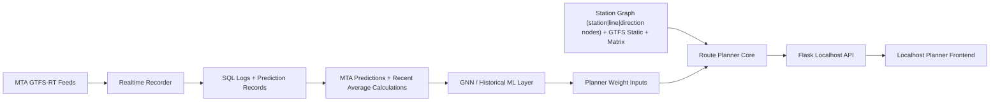

# MetroMinute RT Data Gatherer + Route Planner

Portfolio repository focused on two production-relevant transit AI/data components from MetroMinute:
- Real-time GTFS-RT data gathering + SQL logging
- Weighted subway route planning

## Quick Gloss
- Real-time collector ingests MTA GTFS-RT feeds and stores prediction-vs-actual evaluation data.
- Route planner computes transfer-aware paths using line and direction-aware graph nodes.
- Localhost planner UI gives a polished frontend experience for route planning, station lookup, and runtime diagnostics.

## WIP Context
- This repository is a work-in-progress portfolio slice of MetroMinute.
- It demonstrates core engineering systems (realtime data loop + planner + UI), not every production feature.
- The goal is to show how data, modeling, and routing infrastructure connect end-to-end.

## MetroMinute Full Scope (Program View)
1. Realtime ingest + recording: pull GTFS-RT feeds, normalize records, and log predictions vs observations.
2. Validation layer: compare MTA predictions, recent average calculations, and GNN/historical ML outputs.
3. Route-planning core: run weighted pathfinding on `station|line|direction` graph topology.
4. Rider product layer: deliver planning UX, station lookup, runtime diagnostics, and API-backed experiences.
5. Continuous improvement loop: use validation outcomes to update planner weights and routing behavior.

## Lean Canvas (WIP)
Lean canvas for the broader MetroMinute effort is documented here:
- [docs/lean_canvas.md](docs/lean_canvas.md)

This repo currently demonstrates highest coverage in:
- `Problem/Solution`: realtime uncertainty + route decision quality
- `Key Metrics`: prediction-vs-actual logging and planner runtime outputs
- `Unfair Advantage`: line/direction-aware planner graph with integrated ML-informed weight loop

## MetroMinute Links
- Website: [metrominutenyc.riverdale.edu](https://metrominutenyc.riverdale.edu/)

## Architecture Diagram



Architecture notes:
- Planner graph nodes are line- and direction-aware (`station_id|line_id|direction`).
- GNN/historical ML is modeled as a layer on top of MTA predictions and recent average calculations, then merged into planner weights.
- The weighted planner consumes both topology features and these runtime-informed weight signals.

## What Works Today
- Realtime recorder captures GTFS-RT snapshots and writes evaluation-ready rows to SQL.
- Route planner computes weighted, transfer-aware paths with line/direction-aware graph nodes.
- Planner supports dynamic runtime indices based on realtime-derived arrival and ride features.
- Localhost frontend provides planning form, advanced weight controls, route-leg rendering, and diagnostics tabs.
- API endpoints for planner, stations, runtime, and health are available through the Flask UI app.
- CLI scripts are available for recorder runs, single-query planning, and localhost frontend startup.

## Validation Status / Current Limitations
- Validation status: the data pipeline needed to compare GNN outputs against MTA TripUpdate predictions is in place and integrated into this repo workflow.
- Validation status: planner and localhost web endpoints are smoke-tested for healthy responses with local datasets.
- Current limitation: frontend is localhost-first by design and not configured as a production internet-facing deployment target.
- Current limitation: this repo focuses on pulling realtime GTFS and merging those signals into validation and route-planner improvement loops, not end-to-end model serving infrastructure.

## Project Components

### 1) RT Data Gatherer
File:
- `src/metrominute_rt/realtime_recorder.py`

What it does:
- Polls multiple MTA GTFS-RT feeds
- Persists snapshots, trip update predictions, inferred arrivals, and match/eval rows
- Uses cache fallback for temporary upstream issues
- Runs cleanly as a Flask-side background service (cron/worker) with shared env config

GNN validation and planner integration:
- Uses the data gatherer to build aligned prediction-vs-observation records from MTA realtime feeds.
- Supports analysis that compares GNN outputs against MTA TripUpdate predictions for validation.
- Feeds validated insights back into route-planner runtime behavior and weighting decisions.

Run:
```bash
python scripts/run_recorder.py --interval-seconds 20 --prediction-field arrival --run-label local-test
```

### 2) Route Planner
File:
- `src/metrominute_rt/route_planner.py`

What it does:
- Builds a weighted transit graph from station + GTFS data
- Plans routes with transfer and line-switch penalties
- Supports dynamic runtime indices from realtime trip updates

Run one query:
```bash
python scripts/plan_route.py \
  --from R16 \
  --to A27 \
  --station-graph-path /absolute/path/to/station_details.json \
  --gtfs-dir /absolute/path/to/gtfs_static \
  --matrix-path /absolute/path/to/non_weighted_planning_graph_matrix.json
```

### 3) Localhost Route Planner UI
Files:
- `src/metrominute_rt/webapp.py`
- `src/metrominute_rt/web/templates/index.html`
- `src/metrominute_rt/web/static/app.js`
- `src/metrominute_rt/web/static/styles.css`

What it does:
- Runs the route planner behind localhost Flask endpoints (`/api/routes/plan`, `/api/stations`, `/api/runtime`).
- Serves a polished tabbed frontend with:
  - planner form and advanced weight controls
  - leg-by-leg route rendering with line chips and summary metrics
  - station directory and runtime graph/cache diagnostics
- Mirrors the same planner capability used in MetroMinute while keeping all frontend/API behavior local.
- Uses only local frontend assets and relative localhost API calls.

Run locally:
```bash
python scripts/run_route_planner_web.py \
  --port 8080 \
  --station-graph-path /absolute/path/to/station_details.json \
  --gtfs-dir /absolute/path/to/gtfs_static \
  --matrix-path /absolute/path/to/non_weighted_planning_graph_matrix.json
```

Then open:
- `http://127.0.0.1:8080/`

## Setup

```bash
python3 -m venv .venv
source .venv/bin/activate
pip install --upgrade pip
pip install -r requirements.txt
cp .env.example .env
```

Set `.env` values:
- `DATABASE_URL` required for recorder
- `MTA_API_KEY` optional but recommended for full realtime coverage
- `MMRT_STATION_GRAPH_PATH` + `MMRT_GTFS_DIRS` required for localhost planner UI when CLI flags are not provided

Flask deployment note:
- This recorder is intended to run beside Flask (same runtime env, same DB URL), not inside request handlers.
- Preferred production mode is scheduler/cron invocation of `scripts/run_recorder.py`.

## Repository Layout

```text
src/metrominute_rt/
  realtime_recorder.py
  route_planner.py
  webapp.py
  web/
    templates/index.html
    static/app.js
    static/styles.css
scripts/
  run_recorder.py
  plan_route.py
  run_route_planner_web.py
docs/
  architecture.md
  lean_canvas.md
```

## Notes
- GTFS-RT upstream behavior can vary by feed and auth mode.
- In degraded states, this repo reports warnings instead of escalating every partial issue as a hard error.
- This repo intentionally separates data gathering and planning concerns for easier deployment.
